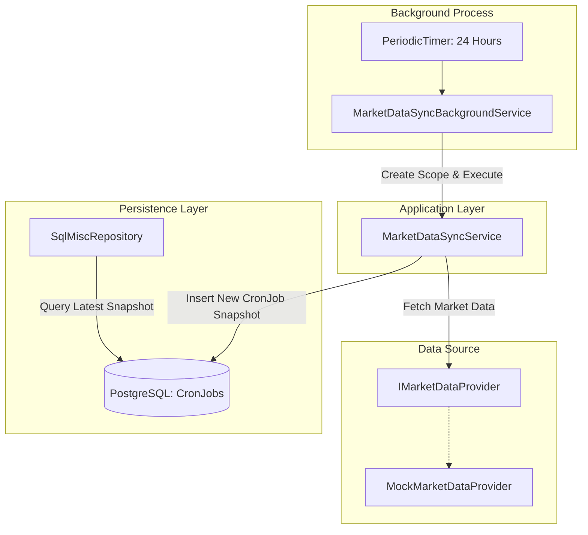

# Requirements

### Overview & Goals
Introduce an automated, daily background service in the backend that periodically fetches market data (via a decoupled provider abstraction, backed initially by a synthetic mock implementation) and persists fresh daily snapshots into the PostgreSQL `CronJobs` table. This ensures the application reliably maintains up-to-date market data for `SqlMiscRepository` without requiring manual triggers or external orchestrator complexity.

### Scope
- **In Scope**:
  - Abstraction interface `IMarketDataProvider` for market data feeds.
  - Concrete `MockMarketDataProvider` generating synthetic daily market figures (indices, news, sectors, gainers/losers, industries).
  - Domain synchronization service `MarketDataSyncService` coordinating data retrieval, JSON serialization, and entity insertion into `CronJobs`.
  - Hosted `BackgroundService` (`MarketDataSyncBackgroundService`) scheduling executions once per 24-hour cycle using `PeriodicTimer`.
  - Configuration options for synchronization intervals and startup delays.
  - Comprehensive unit test suites across application and infrastructure test projects.
- **Out of Scope**:
  - Direct integration with third-party paid market data APIs (e.g., Bloomberg, Yahoo Finance, Alpha Vantage) — the architecture will provide the seam for future drop-in replacement.
  - Distributed lock orchestration (e.g., Redis / pg_advisory_lock), as the current architecture operates as a single-instance backend host.

### User Stories
- **As a system consumer / frontend user**, I want market metrics (indices, news, gainers) to be refreshed daily so that I always see recent market conditions.
- **As a developer / maintainer**, I want a pluggable `IMarketDataProvider` abstraction so that replacing the mock data feed with a real market API later requires zero changes to the background scheduler or persistence pipeline.

### Functional Requirements
- **FR-1**: The background service must trigger once every 24 hours (configurable via options) and optionally execute an initial run on service startup if configured.
- **FR-2**: In each cycle, the service must query all 7 market datasets (`Indices`, `TopNews`, `SectorPerformance`, `Gainers`, `Losers`, `TopIndustries`, `WorstIndustries`) from `IMarketDataProvider`.
- **FR-3**: Fetched datasets must be serialized to JSON and persisted as a single new `CronJob` record with `Date = DateTime.UtcNow` and a unique `Guid` identifier.
- **FR-4**: Execution failures in the background service must be caught, logged with structured diagnostics, and must not terminate the main application process.

### Non-Functional Requirements
- **Reliability & Resilience**: Any transient failure during synchronization must not terminate the background loop; subsequent cycles must continue as scheduled.
- **Resource Efficiency**: Use `PeriodicTimer` for minimal CPU and memory overhead during idle periods.
- **Maintainability**: Clean architectural separation across Application (orchestration) and Infrastructure (provider, scheduler, EF Core persistence).

# Technical Design

### Current Implementation
- `Infrastructure.Persistence.Entities.CronJob` represents a daily snapshot table containing JSON string columns for `IndicePerfomance`, `TopNews`, `SectorPerformance`, `Gainers`, `Losers`, `TopIndustries`, and `WorstIndustries`.
- `SqlMiscRepository` reads the latest `CronJob` entry sorted by `Date DESC` and deserializes JSON payloads into domain models.
- `MiscRepository` currently provides synthetic mock data directly in-memory using `Bogus`.
- `MarketWizard.Server` boots with ASP.NET Core and Aspire service defaults, applying EF Core database migrations on startup.

### Key Decisions
- **Standard .NET `BackgroundService` with `PeriodicTimer` over external heavy frameworks (Quartz / Hangfire)**: Maximizes utility by avoiding external dependency bloat, infrastructure costs, and storage overhead while natively integrating with ASP.NET Core lifetime management.
- **Decoupled `IMarketDataProvider` Provider Abstraction**: Separates the market data source from the persistence and scheduling logic, maximizing long-term efficiency when swapping the mock provider for live external HTTP APIs.
- **Explicit Application Service (`MarketDataSyncService`)**: The background worker delegates execution to a scoped application service, ensuring clean dependency resolution for EF Core `MarketWizardContext` and enabling direct unit testing without mocking timers.

### Proposed Changes
1. **Application Layer (`MarketWizard.Application`)**:
   - `Interfaces/IMarketDataProvider.cs`: Declares asynchronous fetch operations for all market data categories.
   - `Interfaces/IMarketDataSyncService.cs`: Declares `Task SyncDailyMarketDataAsync(CancellationToken cancellationToken = default)`.
   - `Services/MarketDataSyncService.cs`: Implements data fetching, JSON serialization via `System.Text.Json`, and entity addition to `MarketWizardContext.CronJobs`.
   - `ServiceRegistration.cs`: Registers `IMarketDataSyncService` as scoped.

2. **Infrastructure Layer (`MarketWizard.Infrastructure`)**:
   - `Services/MockMarketDataProvider.cs`: Implements `IMarketDataProvider` producing realistic market data models using `Bogus`.
   - `Configuration/MarketDataSyncOptions.cs`: Binds configuration properties (`IntervalHours`, `RunOnStartup`, `InitialDelaySeconds`).
   - `BackgroundServices/MarketDataSyncBackgroundService.cs`: `BackgroundService` that creates a service scope per tick and calls `IMarketDataSyncService.SyncDailyMarketDataAsync`.
   - `ServiceRegistration.cs`: Registers `IMarketDataProvider`, options configuration, and `AddHostedService<MarketDataSyncBackgroundService>()`.

3. **Testing Layer (`MarketWizard.Application.UnitTests` & `MarketWizard.Infrastructure.UnitTests`)**:
   - Unit tests for `MarketDataSyncService` verifying all datasets are collected and saved to `CronJobs`.
   - Unit tests for `MockMarketDataProvider` verifying data format compliance.
   - Unit tests for background service lifecycle and cancellation token handling.

### Data Models / Contracts
```csharp
namespace MarketWizard.Application.Interfaces;

public interface IMarketDataProvider
{
    Task<IndicePerformanceData> GetIndicesAsync(CancellationToken cancellationToken = default);
    Task<TopNewsData> GetTopNewsAsync(CancellationToken cancellationToken = default);
    Task<SectorPerformanceData> GetSectorPerformanceAsync(CancellationToken cancellationToken = default);
    Task<GainersData> GetTopGainersAsync(CancellationToken cancellationToken = default);
    Task<GainersData> GetTopLosersAsync(CancellationToken cancellationToken = default);
    Task<GainersData> GetTopIndustriesAsync(CancellationToken cancellationToken = default);
    Task<GainersData> GetWorstIndustriesAsync(CancellationToken cancellationToken = default);
}

public interface IMarketDataSyncService
{
    Task SyncDailyMarketDataAsync(CancellationToken cancellationToken = default);
}

public class MarketDataSyncOptions
{
    public const string SectionName = "MarketDataSync";
    public double IntervalHours { get; set; } = 24.0;
    public bool RunOnStartup { get; set; } = true;
    public int InitialDelaySeconds { get; set; } = 5;
}
```

### Architecture Diagram


### File Structure
- `MarketWizard.Application/`
  - `Interfaces/`
    - `IMarketDataProvider.cs` *(new)*
    - `IMarketDataSyncService.cs` *(new)*
  - `Services/`
    - `MarketDataSyncService.cs` *(new)*
  - `ServiceRegistration.cs` *(modified)*
- `MarketWizard.Infrastructure/`
  - `BackgroundServices/`
    - `MarketDataSyncBackgroundService.cs` *(new)*
  - `Configuration/`
    - `MarketDataSyncOptions.cs` *(new)*
  - `Services/`
    - `MockMarketDataProvider.cs` *(new)*
  - `ServiceRegistration.cs` *(modified)*
- `MarketWizard.Application.UnitTests/`
  - `MarketDataSyncServiceUnitTest.cs` *(new)*
- `MarketWizard.Infrastructure.UnitTests/`
  - `MockMarketDataProviderUnitTest.cs` *(new)*

### Risks
- **Concurrency & DbContext Lifetimes**: `BackgroundService` is a singleton, whereas `MarketWizardContext` is scoped. *Mitigation*: Inject `IServiceScopeFactory` to resolve fresh, scoped instances of `IMarketDataSyncService` per execution cycle.
- **Application Startup Race Condition**: Database migrations run at startup; executing immediately could hit unmigrated tables. *Mitigation*: Introduce an initial delay or let migrations finish before the first tick.
- **Memory Consumption over Time**: Ensure all created scopes are disposed via `await using` to prevent memory leaks in long-running processes.

# Testing

### Validation Approach
Automated testing using xUnit and NSubstitute will validate synchronization logic, database persistence, serialization fidelity, error containment, and background worker loop lifecycle without spinning unneeded network threads.

### Key Scenarios
- **Complete Snapshot Persistence**: Verify that `MarketDataSyncService` retrieves all 7 datasets, populates JSON fields on a new `CronJob` entity, sets `Date` to UTC now, and executes `SaveChangesAsync`.
- **Mock Feed Generation**: Verify `MockMarketDataProvider` produces populated items for all categories conforming to domain models.
- **Provider Error Isolation**: Verify that when `IMarketDataProvider` throws an exception, `MarketDataSyncService` logs the incident, rethrows/handles appropriately, and `MarketDataSyncBackgroundService` catches it without stopping the background loop.
- **Periodic Execution & Cancellation**: Verify that `MarketDataSyncBackgroundService` gracefully exits when `CancellationToken` is cancelled during startup or between execution cycles.

### Edge Cases
- **Null / Partial Payloads**: Verify handling when provider returns collections with 0 items; serialization should still generate valid JSON (`[]`).
- **Rapid Cancellation**: Verify clean teardown when cancellation token fires while `PeriodicTimer.WaitForNextTickAsync` is awaiting.

### Test Changes
- **Add** `MarketWizard.Application.UnitTests/MarketDataSyncServiceUnitTest.cs` (unit tests covering `MarketDataSyncService` using EF Core in-memory / mock provider).
- **Add** `MarketWizard.Infrastructure.UnitTests/MockMarketDataProviderUnitTest.cs` (unit tests covering `MockMarketDataProvider`).
- **Run** full test suite via `dotnet test` ensuring 100% pass rate.

# Delivery Steps

### ✓ Step 1: Define market data provider abstraction and synchronization service
The domain contracts for market data extraction and snapshot synchronization are defined and registered.

- Add `IMarketDataProvider` to `MarketWizard.Application/Interfaces` with methods for fetching indices, news, sector performance, gainers, losers, and top/worst industries.
- Add `IMarketDataSyncService` to `MarketWizard.Application/Interfaces` defining the `SyncDailyMarketDataAsync` execution contract.
- Implement `MarketDataSyncService` in `MarketWizard.Application/Services` to fetch data from `IMarketDataProvider`, serialize payloads into JSON, and persist a new `CronJob` entity in `MarketWizardContext`.
- Register `IMarketDataSyncService` in `MarketWizard.Application/ServiceRegistration.cs`.
- Add unit tests in `MarketWizard.Application.UnitTests/MarketDataSyncServiceUnitTest.cs` validating successful sync orchestration and error handling.

### ✓ Step 2: Implement mock market data provider
A robust mock market data provider is available to supply synthetic market feeds for testing and development.

- Implement `MockMarketDataProvider` in `MarketWizard.Infrastructure/Services` implementing `IMarketDataProvider` using `Bogus` to generate realistic market datasets.
- Register `IMarketDataProvider` with `MockMarketDataProvider` implementation in `MarketWizard.Infrastructure/ServiceRegistration.cs`.
- Add unit tests in `MarketWizard.Infrastructure.UnitTests` validating mock feed generation and payload completeness.

### ✓ Step 3: Implement daily background worker and dependency injection registration
A hosted background service runs once per day to automatically trigger market data synchronization with resilient error handling.

- Create `MarketDataSyncOptions` in `MarketWizard.Infrastructure/Configuration` to configure execution interval (default: 24 hours), initial delay, and enable/disable toggle via `appsettings.json`.
- Implement `MarketDataSyncBackgroundService` in `MarketWizard.Infrastructure/BackgroundServices` inheriting from `BackgroundService`, creating an `IServiceScope` per execution to invoke `IMarketDataSyncService`.
- Use `PeriodicTimer` with cancellation token support, structured logging, and robust exception boundaries to prevent host crashes on transient failures.
- Register the hosted service in `MarketWizard.Infrastructure/ServiceRegistration.cs`.
- Add unit tests in `MarketWizard.Infrastructure.UnitTests` validating scoped execution, cancellation handling, and error logging.